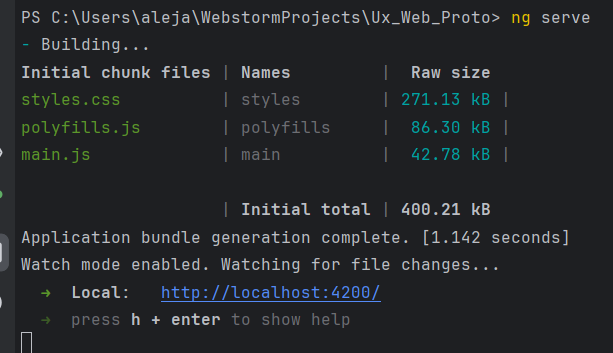

# Ux_Web_Proto
Prototipo web

# Prerequisitos

- NodeJS v20.9.0
- npm v10.1.0
- angular v17.2.3

# Ejecucion

- Para ejecutar la aplicacion dirijase a la raiz del proyecto y 
ejecute el comando _*npm install*_ para instalar las dependencias
- Luego ejecute el comando _*ng serve*_ para iniciar la aplicación

